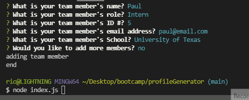
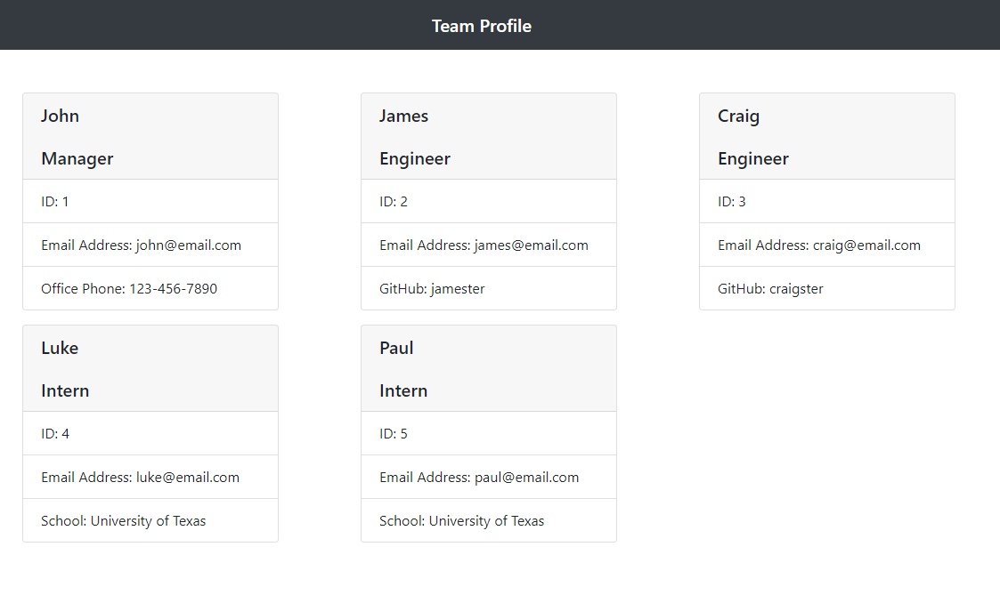

# profileGenerator

 

For my 10th weekly challenge assignment submission.

This application is a Node-based command line tool for generating an HTML file displaying the information of a development team. 

### Usage

To run this application, run 'node index.js' from the root directory of the deployment. You may need to run 'npm install' to acquire necessary dependencies.

### Questions? 
GitHub: [@rjcostanzo](https://api.github.com/users/rjcostanzo)